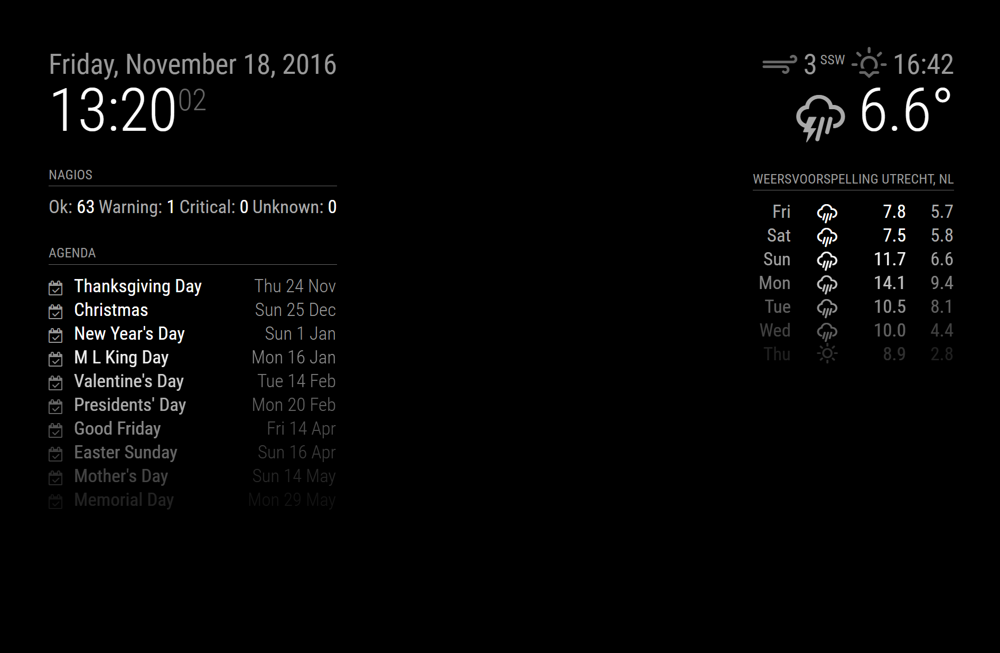

# Nagios - MagicMirror² module

[](https://travis-ci.org/qistoph/MMM-nagios)

This is a module for [MagicMirror²](https://github.com/MichMich/MagicMirror).
Shows informantion from nagios.



## Installing the module

The module uses the JSON formatted Nagios status as formattted by [php-nagios-json](https://github.com/lizell/php-nagios-json).

To install the module, just clone this repository to your __modules__ folder:
`git clone https://github.com/qistoph/MMM-nagios.git nagios`.
The run `cd nagios` and `npm install` to install the dependencies.

## Updating the module

Pull the git updates: `git pull`.
The update dependencies in the module folder: `cd nagios` followed by `npm install`.

## Using the module

To use this module, add it to the modules array in the `config/config.js` file:

```javascript
modules: [
  {
    module: 'nagios',
    position: 'top_right',
    header: 'Nagios',
    config: {
      statusUrl: 'https://<YOUR URL>/',
      user:'Basic auth username',
      pass: 'Basic auth password'
    }
  }
]
```

## Configuration options

The following properties can be configured:

<table width="100%">
  <thead>
    <tr>
      <th>Option</th>
      <th width="100%">Description</th>
    </tr>
  </thead>
  <tbody>
    <tr>
      <td><code>statusUrl</code></td>
      <td>The URL to get the status from. Must be a php-nagios-json page.<br>
      <br><b>Required</b></td>
    </tr>
    <tr>
      <td><code>username</code></td>
      <td>HTTP Basic Auth username, if need to access the page.<br>
      <br><b>Optional</b></td>
    </tr>
    <tr>
      <td><code>password</code></td>
      <td>HTTP Basic Auth password, should be specified if the username is.<br>
      <br><b>Optional</b></td>
    </tr>
    <tr>
      <td><code>reloadInterval</code></td>
      <td>Number of milliseconds between refresh.<br>
      <br><b>Default value:</b> <code>5 * 60 * 1000</code> (5 minutes)</td>
    </tr>
    <tr>
      <td><code>labels</code></td>
      <td>Defines the labels for each type of status.<br>
      <br><b>Default value:</b><br><pre><code>labels: {
  'ok': 'Ok',
  'warning': 'Warning',
  'critical': 'Critical',
  'unknown': 'Unknown'
}</pre></code>
      </td>
    </tr>
  </tbody>
</table>
